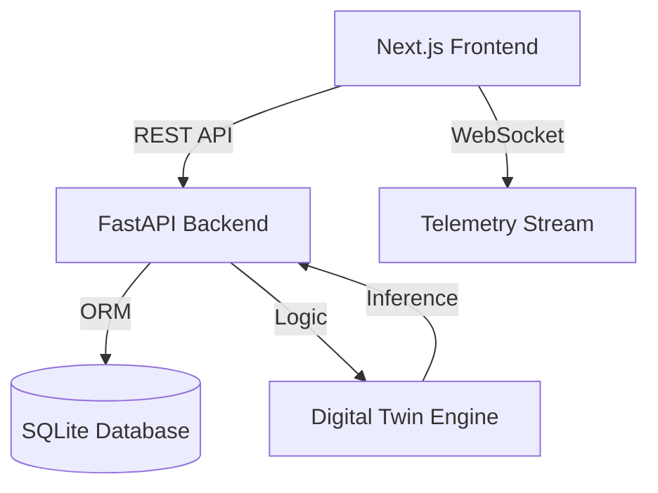

# 🧠 JourneyMind AI: Prediction-Led Journey Orchestration

[](https://nextjs.org/)
[](https://fastapi.tiangolo.com/)
[](https://tailwindcss.com/)
[](https://opensource.org/licenses/MIT)

> **"Transform how you engage. Predict before they churn."**
> JourneyMind AI is a premium SaaS platform designed for modern product teams to simulate, predict, and orchestrate customer journeys using AI-powered Digital Twins.

---

## 📽️ Demo & Screenshots

*(Add your high-res screenshots here)*

---

## 🚀 Vision & Innovation

JourneyMind AI doesn't just track customer behavior—it **anticipates** it. By leveraging a behavioral inference engine, we create **Digital Twins** of personas (Premium, Standard, Trial) to stress-test journey workflows in a risk-free simulation environment.

### Why JourneyMind?
- **Proactive Retention**: Don't wait for churn alerts. Simulate different path outcomes and pivot early.
- **Visual Builder**: Design complex multi-step workflows without a single line of code.
- **Live Observability**: Real-time WebSocket telemetry feed for an "Air Traffic Control" view of your customer base.

---

## 🛠️ Tech Stack & Architecture

### Frontend
- **Framework**: Next.js 15 (App Router, Turbopack)
- **Styling**: Tailwind CSS V4 + shadcn/ui (Custom Glassmorphism theme)
- **Animations**: Framer Motion (Micro-interactions & transitions)
- **State/Real-time**: WebSocket integration for live telemetry

### Backend
- **Engine**: FastAPI (Python)
- **Database**: SQLite (SQLAlchemy ORM)
- **AI Logic**: Behavioral Inference Simulator (Monte Carlo logic)

### Architecture Diagram


---

## 📦 Getting Started

### Prerequisites
- Node.js 20+
- Python 3.10+

### Installation

1. **Clone the repository**
   ```bash
   git clone https://github.com/triptithawait/journeymind-ai.git
   cd journeymind-ai
   ```

2. **Frontend Setup**
   ```bash
   npm install
   npm run dev
   ```

3. **Backend Setup**
   ```bash
   cd backend
   pip install -r requirements.txt
   py run.py
   ```

---

## 📑 API Documentation

The backend provides a full Swagger UI at `http://127.0.0.1:8000/docs`.

### Key Endpoints
- `GET /api/v1/customers`: Fetch all customer segments.
- `POST /api/v1/simulations/run`: Trigger a behavioral simulation for a specific twin.
- `WS /api/v1/telemetry/stream`: Real-time event stream.

---

## 🗺️ Roadmap & Future Scope
- [ ] **GPT-4 Integration**: Auto-generate journeys from natural language.
- [ ] **Multi-Channel Adapters**: Native SDKs for Web, iOS, and Android.
- [ ] **Predictive LTV Analytics**: Deep-learning models for long-term revenue forecasting.

---

## 🤝 Contributing
Contributions are welcome! Please open an issue first to discuss what you would like to change.

## 📄 License
This project is licensed under the MIT License - see the [LICENSE](LICENSE) file for details.

---
**Made with ❤️ at JourneyMind Labs.**
